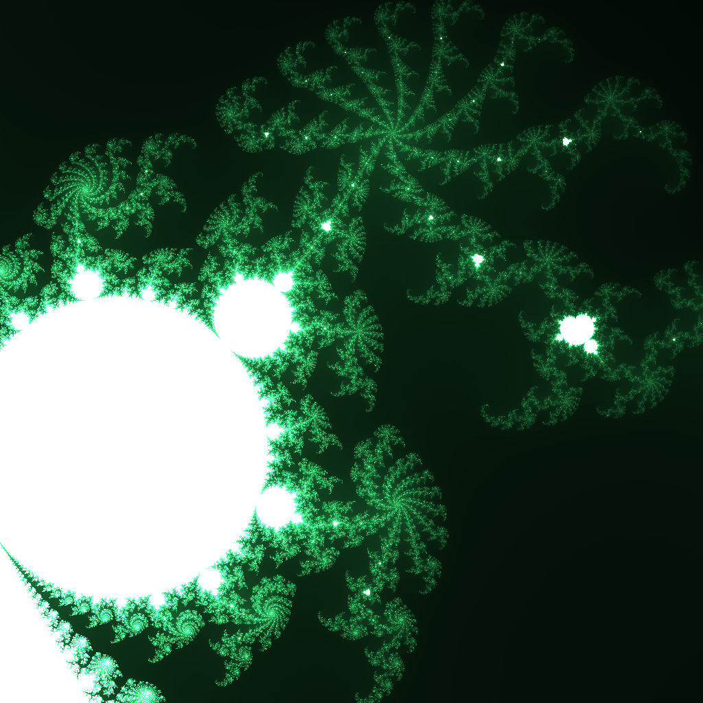

实战画布
Canvas in action
=======

在电脑上绘画，有很多种方法。一种方法，是直接使用鼠标、键盘在屏幕上画。这种方法被称为What you see is what you get- WYSIWYG-所见即所得。这种方法直观，容易掌握。但是缺点是费时间，缺乏一定的可重用性、灵活性；另一种，叫What you think is what you get - WYTIWYG - 所思即所得。这种方法就是使用程序做画。这种方法也有缺点，就是需要学习一门语言。

In learning we trust - 学习是一种信仰。人之所为走到今天的智慧生物，就是因为学习带来不断的进步。
程序绘画和手工绘画比起来，有时就像写一个万字，和写一万个一字一样-程序可以非常容易地画10,000条线，但是使用手工，却会“累死个人儿”。不过，得到好的方法，是要付出努力的。

另外，由于程序语言最新的资料是英文，所以这本书中，会夹杂一些英文。这样相当于同时学了两门语言-计算机编程语言以及英语，真是一举多得。不过，这需要不怕艰苦的人。

为什么有容易的事，我们却要选择艰苦呢？
我们来看一下下面的图：

(上面图形的源代码可以在这里找到：http://jsfiddle.net/archcra/dLa7wcfo/2/)
这张图理论上可以有无穷的元素，使用程序只有不到100行的代码，而使用手工，将是不可思议的困难。手工画图虽然直观省脑，但是人的长处就是用脑-事物的规律是用进废退；人想要变强，就需要锻炼自己的大脑；过于重复不需要用脑的工作，是思想懒惰的表现；电脑只有使用程序，才有了灵魂。我们学习了如何给电脑设计、创造灵魂，才能让我们生活得更好。我们这样做，是先苦后甜。

