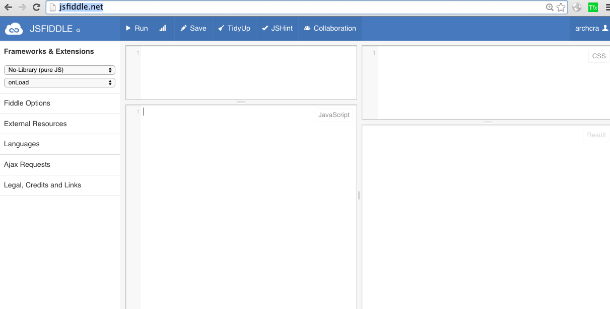
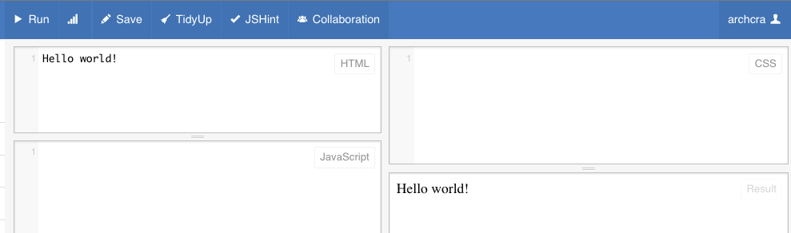
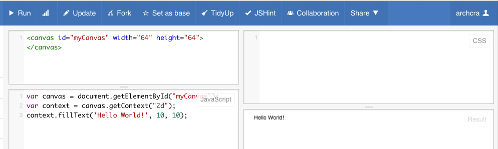

学习编程一般都是从Hello world开始，我们也不例外。

让我们打开浏览器-这里推荐使用的是Chrome，google公司的。

好，我们先学两个单词：

chrome [kroʊm] n.谷歌浏览器； 铬
再学一个汉字：

铬  [gè] <名>[化] chromium (24号元素， 符号 Cr)

 googol [ˈgu:gɔ:l] n.10的100次方，巨大的数字 
 这个单词表示的数是一个很大的数：1后面100个零。当然，我们这本书中并未出现这个单词，它是google的来源。即google这个词，是依据googol造出来的。
 
 好，我们继续。
 
 我们使用chrome浏览器，打开如下网址：
 
 http://jsfiddle.net/
 
 它的界面是下面这个样子：
 
 我们会渐渐熟悉这个界面，目前只要在HTML那个框中，输入：
 Hello world!，然后点一下它左上面的Run，就会在右下的Result中，看到结果：Hello world!
 
 结果象下面的样子：
 


我们就这样完成了Hello world? 如果是讲HTML语言，当然到这里就可以下课了。不过我们对待是Canvas，还是要有一些工作要做的。即，我们要使用的语言是Javascript，是界面开发三剑客之一。刚才的图上，就出现了完整的三剑客：HTML, CSS, Javascript。

这些概念有些多，我们此时知道它们是三剑客就行，下面开始使用三剑客中的两个：
在HTML中输入(请拷贝、粘贴-copy&paste)：


```
<canvas id="myCanvas" width="64" height="64"></canvas>
```

在Javascript中输入(请拷贝、粘贴-copy&paste；以后不再提示)：
```
var canvas = document.getElementById("myCanvas");
var context = canvas.getContext("2d");
context.fillText('Hello World!', 10, 10);

```

我们应该看到下面的结果：



我们这里学习两个单词：
canvas [ˈkænvəs] n. 画布
context  [ˈkɑ:ntekst] n. 上下文； 语境

context是个很难理解的单词，这里可以理解为：画境-绘画的环境。


