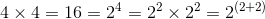
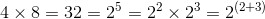
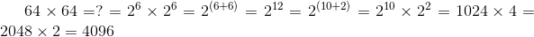
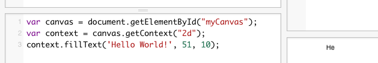
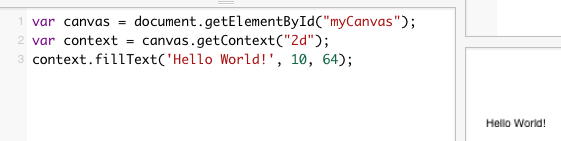
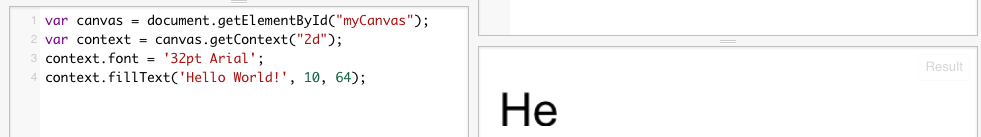
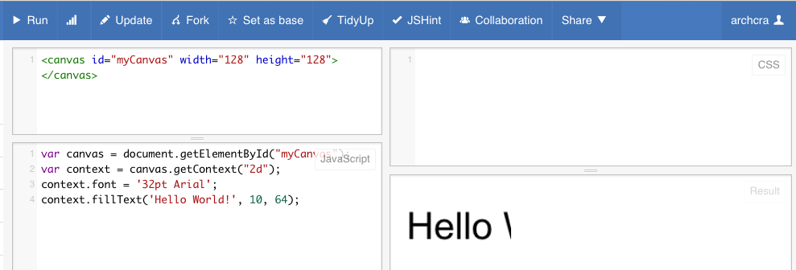
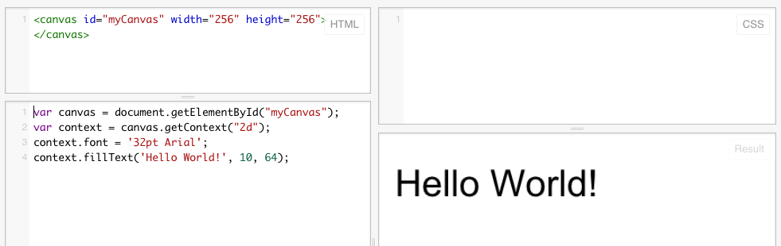

向画布上画图，先要了解它的位置。按几何学来讲，叫坐标系。画布的坐标系是这个样子：


我们复习一下上节课，来看看位置在哪里。

在剑客HTML区域，我们的代码如下：
```
<canvas id="myCanvas" width="64" height="64"></canvas>
```
这里，有两个数字：64。它们对应的是宽和高，单位是象素。即定义了一块64个象素宽，64个象素高的一块画布。
那这个画布有多少个点呢？ 64* 64 = ?

我们来学习一下幂和乘的关系：


再来看一个例子：


好，找到规律了么？ 我们开始：



对，我们的64*64的画布上，有4096个像素，或者说，有4096个点。

我们再来看看剑客Javascript的代码：
```
var canvas = document.getElementById("myCanvas");
var context = canvas.getContext("2d");
context.fillText('Hello World!', 10, 10);

```
这里面，两个10也表示位置，表示上面图中的x和y。
第一个10是x，第二个10是y。即在横向从左向右数第10象素处，纵向从上向下数第10象素处，开始写出信息；Hello world.

我们做一下实验，来看看是不是这样：
将最后一行代码改成：
```
context.fillText('Hello World!', 51, 10);

```

我们会看到，就剩下he了-这是因为x太靠右边，导致超出了右边界。


类似地，我们修改代码：
```
context.fillText('Hello World!', 10, 64);

```


我们会发现，Hello world跑到下面去了。这是因为y增大了的原因。


是不是感觉我们的字太小了啊，那我们把它弄大一点：
我们最后的一行前增加一行，改成这样：
```
context.font = '32pt Arial';
context.fillText('Hello World!', 10, 64);
```

然后看起来就是这个样子：


字是大了，可是看不全了，我们把画布再加大一些：

修改HTML处:
```
<canvas id="myCanvas" width="128" height="128"></canvas>
```
改完之后，别忘了Run。我们会看到下面的样子：




还是再大一些吧：
```
<canvas id="myCanvas" width="256" height="256"></canvas>
```


这回差不多了。还可以再大些么？


