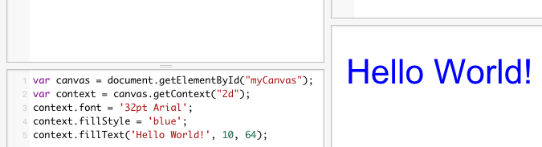
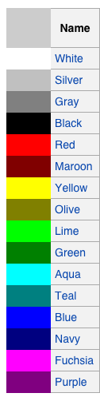
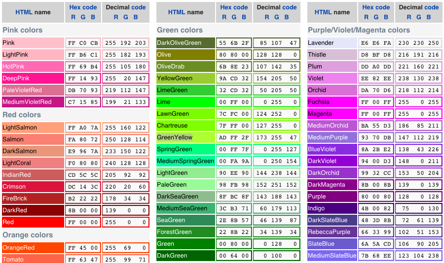

我们的文字还没有颜色，我们给上用一下蓝色试试：


```
ctx.fillStyle = 'blue'
```

完整的Javascript象下面这样：
```
var canvas = document.getElementById("myCanvas");
var context = canvas.getContext("2d");
context.font = '32pt Arial';
context.fillStyle = 'blue';
context.fillText('Hello World!', 10, 64);
```

我们会看到下面的效果：




都有哪些颜色可以用呢？这里有一个列表：




当然，还有更全的列表：




挺多吧，不过这也只是一部份。以上信息来自于wikipedia，如果想查找更多的颜色，可以参考如下网址：

https://en.wikipedia.org/wiki/Web_colors
http://www.w3.org/TR/SVG/types.html#ColorKeywords
http://www.w3.org/TR/css3-color/

