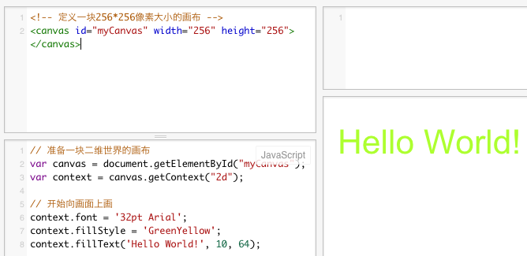

我们已能够向画布上写字，指定位置写字，并且可以设置字的颜色。
那么，我们回头来看看我们的代码。我们在HTML中，相当于找了一些指定大小的画布；在Javascript中，我们先准备一块二维空间的画布，然后，是开始向上画东西。

在写代码时，可以向代码中加入说明，这个叫作：注释。为了将注释与正常的代码区分开来，有一些标记。在HTML中，注释标记是这样的：
```
<!-- 我是注释    --> 
```

在Javascript中，有多种注释方法。下面的是行注释，即将一行信息标记为注释：
```
//我是注释
```

下面的叫块注释，可以将其间所有信息标记为注释。
```
/*
这里全
是
注释
*/

```
注释只是给人阅读代码时起到容易理解代码用的，对于电脑没什么用；电脑会假装看不见它们。

那，我们的代码如果加上注释，可以是下面这个样子：

HTML:
```
<!-- 定义一块256*256像素大小的画布 -->
<canvas id="myCanvas" width="256" height="256"></canvas>
```

Javascript:

```
// 准备一块二维世界的画布
var canvas = document.getElementById("myCanvas");
var context = canvas.getContext("2d");

// 开始向画面上画
context.font = '32pt Arial';
context.fillStyle = 'GreenYellow';
context.fillText('Hello World!', 10, 64);
```


当然，我们看到的它执行的效果，和以前没有不同：




