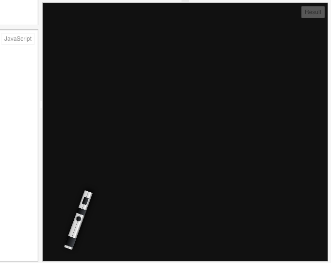
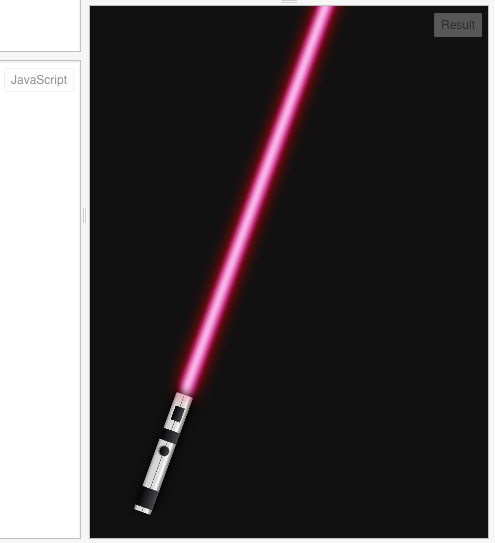
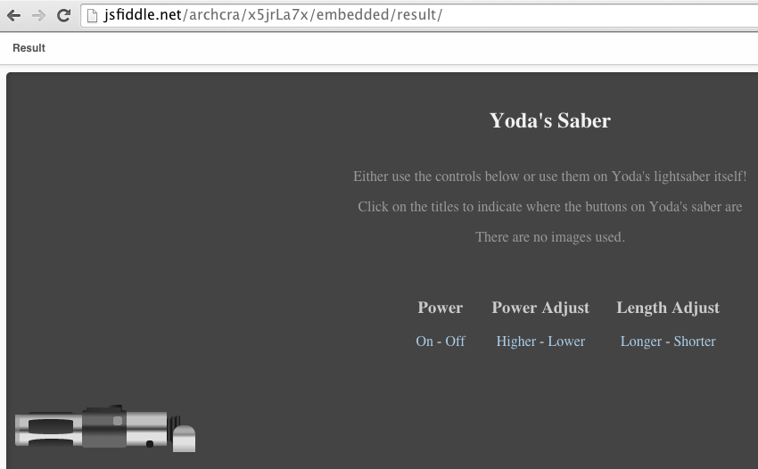
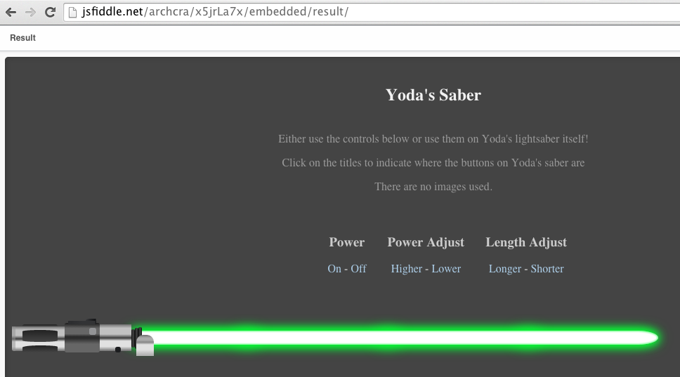
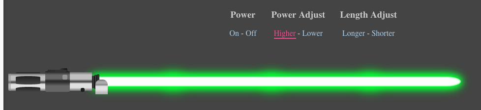
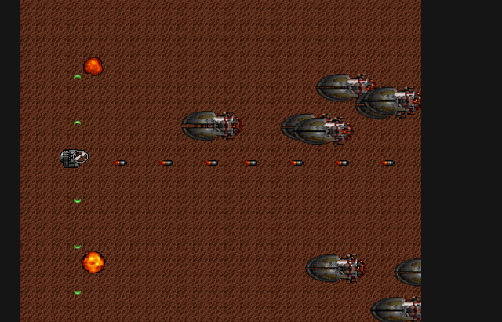

我们虽然说画布很灵活，因为它是使用程序来绘画，相当于我们给了它灵魂。那它究竟能画出什么呢？一种回答可能是：什么都可能。下面给出一个示例，lightsaber-光剑。

oh，对了，还没打开：

这就是程序比静态图片要好地方之一：它是可交互的。就是说，我们可以控制这个光剑是开还是关。

http://jsfiddle.net/archcra/agtdu6ws/2/

当然还有其他人的：

这个还可以能量更高些：

http://jsfiddle.net/archcra/x5jrLa7x/embedded/result/

游戏？当然。下面是个比较简单的射击游戏：

游戏的源码：http://jsfiddle.net/archcra/Lvkqj4up/

这个游戏的作者有很详细的说明：http://jlongster.com/Making-Sprite-based-Games-with-Canvas

