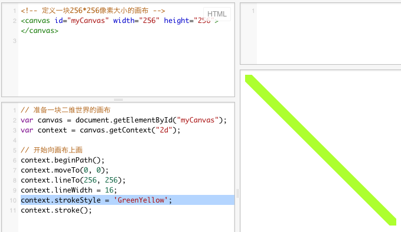

关于context的代码，使用下面的内容：
```
context.beginPath();
context.moveTo(0, 0);
context.lineTo(256, 256);
context.stroke();
```

我们会看到这样的效果：


直线是很简单的形状。这里说的直线，具体指的是线段。要画一条线段，需要提供起点和终点。每个点都由两个自然数构成-一个表示x,一个表示y；x和y分别表示位置中的从左向右的像素点数；以及从上到下的象素点数；

这条线太细了，我们让它粗一点。在最后一句前，加上这句话：
```
context.lineWidth = 16;
```
结果就是这样：


画直线的颜色和我们说过的文字的颜色道理是一样的，但是有区别。在最后一句前加上：
```
context.strokeStyle = 'GreenYellow';
```
效果是这样；



注意是strokeStyle，不是fillStyle。我们这里学习三个单词：
style  [staɪl] n.样式
fill  [fɪl] vt.& vi.（使）充满
stroke [stroʊk] n. (铅笔、刷子的)一笔，一挥，笔画


画线时，线的两端形状也可以指定，如：

分别在最后一句前面加上：
```
context.lineCap = 'square';
```
及
```
context.lineCap = 'round';
```
注意，为了看清楚效果，我们修改了线的起点与终点。

即，完整的部份代码是：
```
// 开始向画布上画
context.beginPath();
context.moveTo(16, 16);
context.lineTo(128, 128);
context.lineWidth = 16;
context.strokeStyle = 'GreenYellow';
context.lineCap = 'round';
context.stroke();
```
效果分别如下所示：


两张图的端点形状，是有区别的；
我们来学两个单词：
square  [skwer] n. 正方形
round  [raʊnd] n. 圆形


以上代码可以在这里演示：
http://jsfiddle.net/archcra/r0g62mza/

