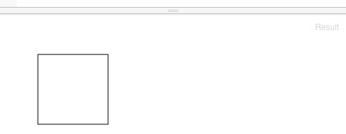
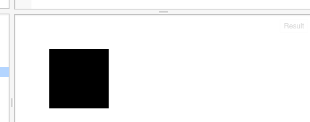
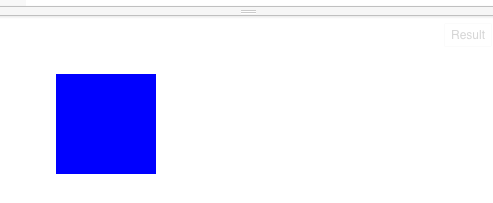

下面的语句，就可以画一个正方形：

```
context.strokeRect(50, 50, 100, 100);
```


画矩形时，我们需要告诉画境(context)：这个矩形的左上角的点是什么。上面的50,50就是左上角的点；第一个50，表示这个位置是从左边开始，第50个像素；第二个50，表示从上面开始，第50个像素；后面的两个100，分别表示矩形的宽和高；这里是宽和高相同，都是100个像素。

我们把strokeRect换成fillRect，可以画一个实心的矩形：

```
context.fillRect(50, 50, 100, 100);
```

样子如下：


当然这一点也不好看，我们可以给它点颜色：

加上这一句：
```
context.fillStyle = 'blue';
```
完整的代码是：
```
// 准备一块二维世界的画布
var canvas = document.getElementById("myCanvas");
var context = canvas.getContext("2d");

// 开始向画布上画
context.fillStyle = 'blue';
context.fillRect(50, 50, 100, 100);
```
我们就会看到颜色变了：




以上代码可以在这里演示：
http://jsfiddle.net/archcra/qaaox7yL/

