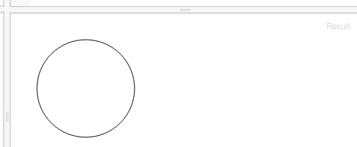
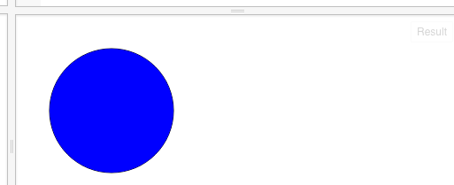
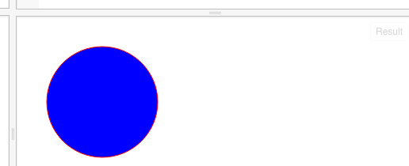
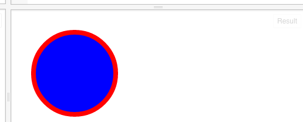

下面的代码，会画出一个圆：
```
// 开始向画布上画
var centerX = 100;
var centerY = 100;
var radius = 70;

context.beginPath();
context.arc(centerX, centerY, radius, 0, 2 * Math.PI, false);
context.stroke();
```




画圆较复杂一些，需要告诉context圆心和半径；圆心是一个点，有两个值，上面的centerX和centerY就是来表示圆心的；

这里学两个单词：
center [ˈsɛntɚ] n.中心
radius [ˈrediəs] n. 半径


我们可以给圆填上颜色：
```
context.fillStyle= 'blue';
context.fill();
```
就会看到这样：



我们还可以指定圆的边的颜色：

```
context.strokeStyle = 'red';
context.stroke();
```
即在stroke函数前面，加上strokeStyle；就可以设置颜色了：


函数？这里带括号的名称，就是函数；以后我们会学习自己写函数；
这里的边框我们看不大清楚，我们可以把边框设置得粗些。在最后一句前，加上：
```
context.lineWidth = 8;
```

就会看到下面的效果了：


有问题？我们比较一下完整的代码：
```
// 准备一块二维世界的画布
var canvas = document.getElementById("myCanvas");
var context = canvas.getContext("2d");

// 开始向画布上画
var centerX = 100;
var centerY = 100;
var radius = 70;

context.beginPath();
context.arc(centerX, centerY, radius, 0, 2 * Math.PI, false);
context.fillStyle = 'blue';
context.fill();
context.strokeStyle = 'red';
context.lineWidth = 8;
context.stroke();
```

以上代码可以在这里演示：
http://jsfiddle.net/archcra/qaaox7yL/6/


