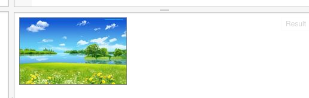
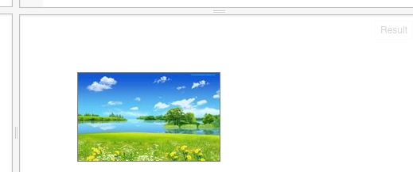

Javascript剑客中，使用如下的代码，可以将一张照片画到画布上：
```
// 准备一块二维世界的画布
var canvas = document.getElementById("myCanvas");
var context = canvas.getContext("2d");

// 开始向画布上画
var img = new Image;
img.src = 'http://s22.postimg.org/8qesqtjlp/nwp_2.jpg?noCache=1439281309';
img.onload = function () {
    context.drawImage(img, 0, 0); 
};
```

它的结果会是下面的样子：



这个代码和以前的比，又有新东西了。比如说 new Image, function()；我们先不用关心这些，先来看代码中的数字；
在引号（''）中的内容是固定内容，我们不需要关心。drawImage函数中的数字，是我们要关心的。对了，这里提一下参数的概念。函数括号中的内容，叫参数。这里的：
```
context.drawImage(img, 0, 0); 
```
有三个参数：img, 0,0
第一个参数表示图片，第二个表示横向的位置，第三个表示纵向的位置；表示位置的数字单位是像素；我们可以试试修改一下它们：

```
context.drawImage(img, 64, 64); 
```
会看到如下的样子：


我们可以看到，图片的位置向下和向右移了一些；


