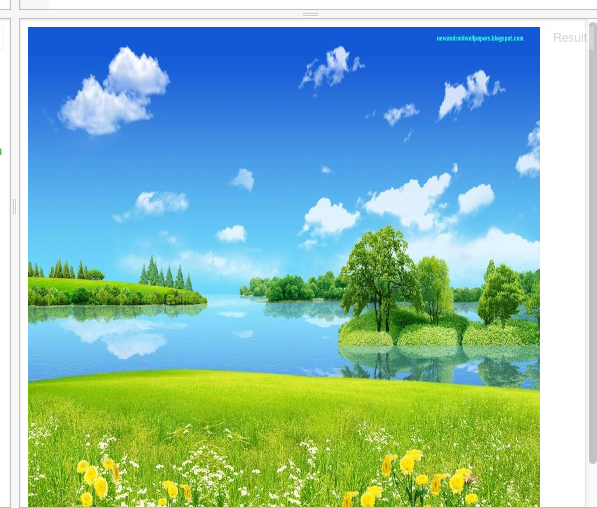
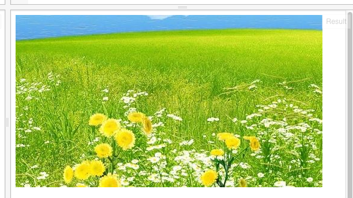

Javascript剑客中，使用如下的代码，可以将一张照片画到画布上：
```
// 准备一块二维世界的画布
var canvas = document.getElementById("myCanvas");
var context = canvas.getContext("2d");

// 开始向画布上画
var img = new Image;
img.src = 'http://s22.postimg.org/8qesqtjlp/nwp_2.jpg?noCache=1439281309';
img.onload = function () {
    context.drawImage(img, 0, 0); 
};
```

它的结果会是下面的样子：


这个代码和以前的比，又有新东西了。比如说 new Image, function()；我们先不用关心这些，先来看代码中的数字；
在引号（''）中的内容是固定内容，我们不需要关心。drawImage函数中的数字，是我们要关心的。对了，这里提一下参数的概念。函数括号中的内容，叫参数。这里的：
```
context.drawImage(img, 0, 0); 
```
有三个参数：img, 0,0
第一个参数表示图片，第二个表示横向的位置，第三个表示纵向的位置；表示位置的数字单位是像素；我们可以试试修改一下它们：

```
context.drawImage(img, 64, 64); 
```
会看到如下的样子：


我们可以看到，图片的位置向下和向右移了一些；


我们可以把图放大：
HTML:
```
<!-- 定义一块512*512像素大小的画布 -->
<canvas id="myCanvas" width="512" height="512"></canvas>
```
Javascript:

```
// 准备一块二维世界的画布
var canvas = document.getElementById("myCanvas");
var context = canvas.getContext("2d");

// 开始向画布上画
var img = new Image;
img.src = 'http://s22.postimg.org/8qesqtjlp/nwp_2.jpg?noCache=1439281309';
img.onload = function () {
    context.drawImage(img, 0, 0, 512, 512);
};
```
我们会看到图被放大了，但是不清楚：


放大是把像素点间的距离加大了，而点的中间没有画面的信息，所以就不清楚了；好在，我们有这个图的清晰版本：
保持画布的大小不变，我们换一张图：
Javascript:
```
// 准备一块二维世界的画布
var canvas = document.getElementById("myCanvas");
var context = canvas.getContext("2d");

// 开始向画布上画
var img = new Image;
img.src = 'http://s30.postimg.org/b2dz50by8/nature_hd_wallpapers_for_android.jpg';
img.onload = function () {
    context.drawImage(img, 0, 0);
};
```

我们会看到：


这个又大了些，看不全了。

我们可以把它缩小一些：修改drawImage这句：
```
    context.drawImage(img, 0, 0, 512, 512);
```


这次图大了，也全了，也清楚。

我们可以将图片的一部份画到画布上：
将drawImage修改一下：
```
    context.drawImage(img, 0, 512, 512, 512, 0, 0, 512, 512);
```

我们发现，这次drawImage这个函数的参数变多了-多了4个；前4个数字参数是指原来图片的位置；后4个数字参数是指画到画布上的位置；它的意思翻译成文字，可以是这样：
把原来这张图从最左面，上面从第512像素，取512*512宽高的区域，画到画布上；画到画布的位置是从左起第0个像素，上起第0个像素，宽512像素，高512像素。有些绕口？从第0个像素？
数字的

|  |  |  |  |  | |
| -- | -- | -- | -- | -- | -- |
| Cardinal | one | two | three | four | five |
|  | 1 | 2 | 3 | 4 | 5 |
| Ordinal | first | second | third | fourth | fifth |
| | 1st | 2nd | 3rd | 4th | 5th |


Cardinal“数数”(第一个数是第三声)，即用来数东西的个数的；
Cardinal可翻译成“序数”，是用来排序的；一般来讲，序数是从1开的；但是在一些数学及几乎所有的计算机领域，是从0开始的；
即有个单词：zeroth，来表示第0个；它就是我们习惯上说的第一个的意思。这个zeroth是容易引起混淆，我们先知道它即可；
参考链接：https://en.wikipedia.org/wiki/Ordinal_number_(linguistics)

