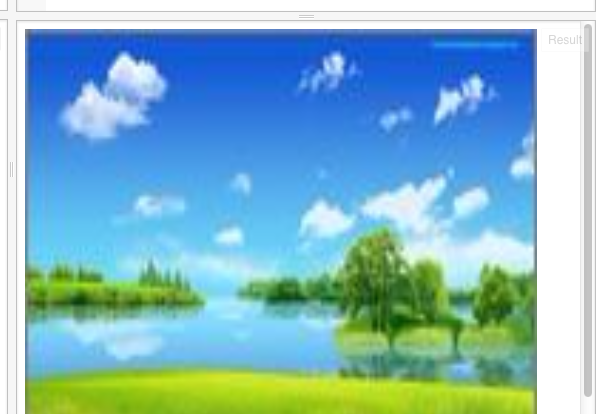
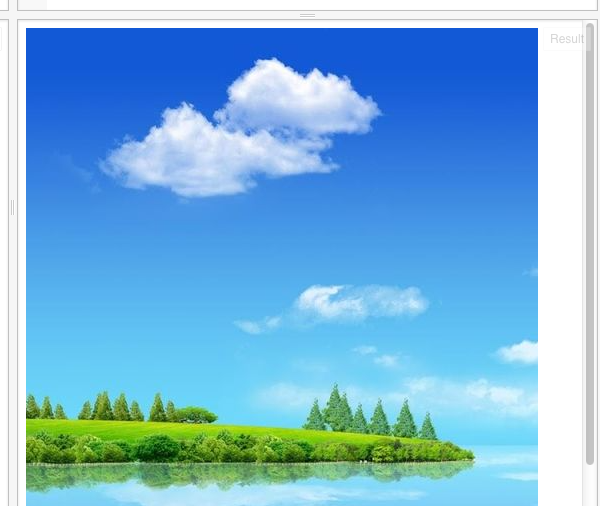
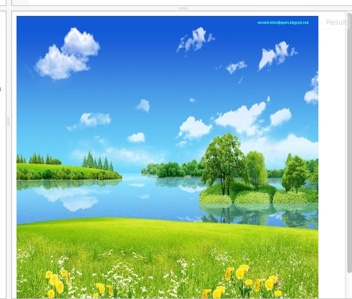

我们可以把图放大：
HTML:
```
<!-- 定义一块512*512像素大小的画布 -->
<canvas id="myCanvas" width="512" height="512"></canvas>
```
Javascript:

```
// 准备一块二维世界的画布
var canvas = document.getElementById("myCanvas");
var context = canvas.getContext("2d");

// 开始向画布上画
var img = new Image;
img.src = 'http://s22.postimg.org/8qesqtjlp/nwp_2.jpg?noCache=1439281309';
img.onload = function () {
    context.drawImage(img, 0, 0, 512, 512);
};
```
我们会看到图被放大了，但是不清楚：



放大是把像素点间的距离加大了，而点的中间没有画面的信息，所以就不清楚了；好在，我们有这个图的清晰版本：
保持画布的大小不变，我们换一张图：
Javascript:
```
// 准备一块二维世界的画布
var canvas = document.getElementById("myCanvas");
var context = canvas.getContext("2d");

// 开始向画布上画
var img = new Image;
img.src = 'http://s30.postimg.org/b2dz50by8/nature_hd_wallpapers_for_android.jpg';
img.onload = function () {
    context.drawImage(img, 0, 0);
};
```

我们会看到：



这个又大了些，看不全了。

我们可以把它缩小一些：修改drawImage这句：
```
    context.drawImage(img, 0, 0, 512, 512);
```


这次图大了，也全了，也清楚。

