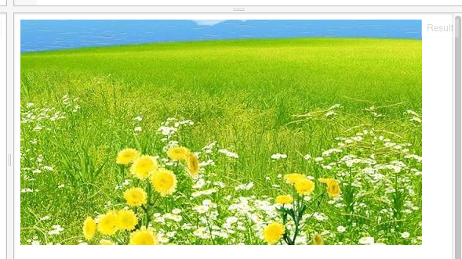

我们可以将图片的一部份画到画布上：
将drawImage修改一下：
```
    context.drawImage(img, 0, 512, 512, 512, 0, 0, 512, 512);
```

我们发现，这次drawImage这个函数的参数变多了-多了4个；前4个数字参数是指原来图片的位置；后4个数字参数是指画到画布上的位置；它的意思翻译成文字，可以是这样：
把原来这张图从最左面，上面从第512像素，取512*512宽高的区域，画到画布上；画到画布的位置是从左起第0个像素，上起第0个像素，宽512像素，高512像素。有些绕口？从第0个像素？
数字的

|  |  |  |  |  | |
| -- | -- | -- | -- | -- | -- |
| Cardinal | one | two | three | four | five |
|  | 1 | 2 | 3 | 4 | 5 |
| Ordinal | first | second | third | fourth | fifth |
| | 1st | 2nd | 3rd | 4th | 5th |


Cardinal“数数”(第一个数是第三声)，即用来数东西的个数的；
Cardinal可翻译成“序数”，是用来排序的；一般来讲，序数是从1开的；但是在一些数学及几乎所有的计算机领域，是从0开始的；
即有个单词：zeroth，来表示第0个；它就是我们习惯上说的第一个的意思。这个zeroth是容易引起混淆，我们先知道它即可；
参考链接：https://en.wikipedia.org/wiki/Ordinal_number_(linguistics)

