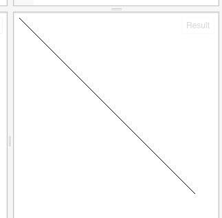
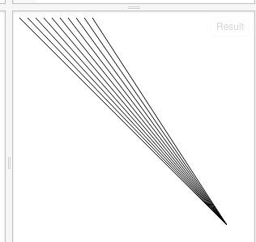

我们可以制作以往照片技术的底片效果，代码如下：
```
// 准备一块二维世界的画布
var canvas = document.getElementById("myCanvas");
var context = canvas.getContext("2d");

// 开始向画布上画
var img = new Image;
img.crossOrigin = "anonymous";
img.src = 'https://dl.dropboxusercontent.com/u/67200561/Pictures/jsfiddle/nature-hd-wallpapers-for-android.jpg';
img.onload = function () {
    context.drawImage(img, 0, 512, 512, 512, 0, 0, 512, 512);

    var imageData = context.getImageData(0, 0, 512, 512);
    var data = imageData.data;

    for (var i = 0; i < data.length; i += 4) {
        // red
        data[i] = 255 - data[i];
        // green
        data[i + 1] = 255 - data[i + 1];
        // blue
        data[i + 2] = 255 - data[i + 2];
    }

    // overwrite original image
    context.putImageData(imageData, 0, 0);
};
```

效果如下：


我们还可以将图片弄成黑白的：

将for循环（什么是循环？）中的内容，改为如下所示：
```
 for (var i = 0; i < data.length; i += 4) {
        var brightness = 0.34 * data[i] + 0.5 * data[i + 1] + 0.16 * data[i + 2];
        // red
        data[i] = brightness;
        // green
        data[i + 1] = brightness;
        // blue
        data[i + 2] = brightness;
    }
```
我们会得到如下效果：


以上代码可以在这里找到：
http://jsfiddle.net/archcra/be7q3hdc/11/

循环是程序中常使用的一种方法，就是把事情重复地做；
以我们画线的例子来说：

```
// 准备一块二维世界的画布
var canvas = document.getElementById("myCanvas");
var context = canvas.getContext("2d");

// 开始向画布上画
context.beginPath();
context.moveTo(0, 0);
context.lineTo(256, 256);
context.stroke();
```

上面的代码是画出了一条线：


我们现在把起始点变一下，然后让它重复画10次，用循环就可以样写：
```
// 准备一块二维世界的画布
var canvas = document.getElementById("myCanvas");
var context = canvas.getContext("2d");

// 开始向画布上画
context.beginPath();
for (var i = 0; i < 10; i = i + 1) {
    context.moveTo(i * 10, 0);
    context.lineTo(256, 256);
}
context.stroke();
```
即每次我们将线的起点的左边距+10个像素。为什么是加10个像素呢？因为在循环里面，变量（什么是变量？）i的值会每次+1，即这句：
```
for (var i = 0; i < 10; i = i + 1) {
```
的意思是：让一个变量（会变的东西）的最开始值是0，然后让它执行{}中的内容；每执行一次，让i的值更新，这里是+1。即第一次循环时，{}中使用i时，i的值是0；第二次时，i是1，...
但这个循环是有上限的，即需要结束的；这里的限制时i要小于10;注意i是自然数，所以在这里，i的最大值是9；
由于语言的历史，i++ 和i = i +1 有相同的效果，所以一般习惯上将i = i + 1 用i++来表示；

i += 4 就是 i = i + 4的意思；就是说，每次循环，i的值涨4。

下面是循环画线后的结果：



参考地址：
http://www.html5canvastutorials.com/advanced/html5-canvas-invert-image-colors-tutorial/

http://www.html5canvastutorials.com/advanced/html5-canvas-grayscale-image-colors-tutorial/

