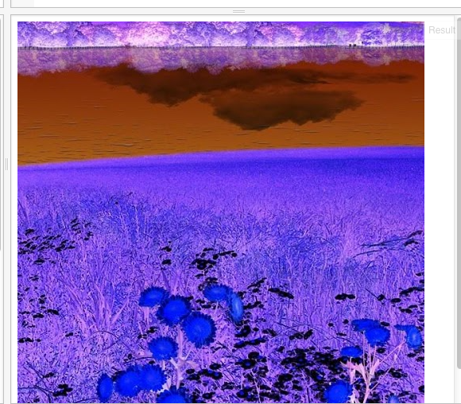
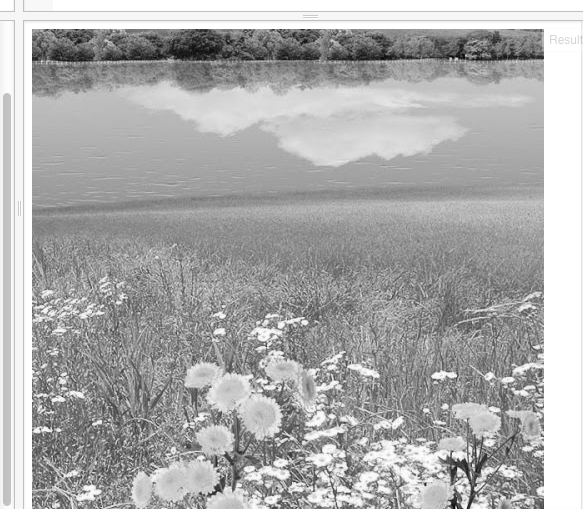

我们可以制作以往照片技术的底片效果，代码如下：
```
// 准备一块二维世界的画布
var canvas = document.getElementById("myCanvas");
var context = canvas.getContext("2d");

// 开始向画布上画
var img = new Image;
img.crossOrigin = "anonymous";
img.src = 'https://dl.dropboxusercontent.com/u/67200561/Pictures/jsfiddle/nature-hd-wallpapers-for-android.jpg';
img.onload = function () {
    context.drawImage(img, 0, 512, 512, 512, 0, 0, 512, 512);

    var imageData = context.getImageData(0, 0, 512, 512);
    var data = imageData.data;

    for (var i = 0; i < data.length; i += 4) {
        // red
        data[i] = 255 - data[i];
        // green
        data[i + 1] = 255 - data[i + 1];
        // blue
        data[i + 2] = 255 - data[i + 2];
    }

    // overwrite original image
    context.putImageData(imageData, 0, 0);
};
```

效果如下：




我们还可以将图片弄成黑白的：

将for循环（什么是循环？）中的内容，改为如下所示：
```
 for (var i = 0; i < data.length; i += 4) {
        var brightness = 0.34 * data[i] + 0.5 * data[i + 1] + 0.16 * data[i + 2];
        // red
        data[i] = brightness;
        // green
        data[i + 1] = brightness;
        // blue
        data[i + 2] = brightness;
    }
```
我们会得到如下效果：



以上代码可以在这里找到：
http://jsfiddle.net/archcra/be7q3hdc/11/

循环是程序中常使用的一种方法，就是把事情重复地做；


参考地址：
http://www.html5canvastutorials.com/advanced/html5-canvas-invert-image-colors-tutorial/

http://www.html5canvastutorials.com/advanced/html5-canvas-grayscale-image-colors-tutorial/

