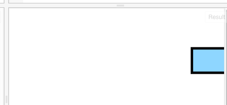

匀速运行的公式是：
distance = velocity * time

距离 = 速度 * 时间

下面的代码就有些复杂了，因为涉及到动画的话，需要的不光是我们要能画，还要能擦。
HTML:

```
<!-- 定义一块640*480像素大小的画布 -->
<canvas id="myCanvas" width="640" height="480"></canvas>
```
这里的变化，就是把画布稍微弄大了一些。

Javascript:
```
 window.requestAnimFrame = (function (callback) {
     return window.requestAnimationFrame || window.webkitRequestAnimationFrame || window.mozRequestAnimationFrame || window.oRequestAnimationFrame || window.msRequestAnimationFrame || function (callback) {
         window.setTimeout(callback, 1000 / 60);
     };
 })();

 function drawRectangle(myRectangle, context) {
     context.beginPath();
     context.rect(myRectangle.x, myRectangle.y, myRectangle.width, myRectangle.height);
     context.fillStyle = '#8ED6FF';
     context.fill();
     context.lineWidth = myRectangle.borderWidth;
     context.strokeStyle = 'black';
     context.stroke();
 }

 function animate(myRectangle, canvas, context, startTime) {
     // update
     var time = (new Date()).getTime() - startTime;

     var linearSpeed = 100;
     // pixels / second
     var newX = linearSpeed * time / 1000;
     myRectangle.x = newX;

     // clear
     context.clearRect(0, 0, canvas.width, canvas.height);

     drawRectangle(myRectangle, context);

     // request new frame
     requestAnimFrame(function () {
         animate(myRectangle, canvas, context, startTime);
     });
 }

 // 准备一块二维世界的画布
 var canvas = document.getElementById('myCanvas');
 var context = canvas.getContext('2d');

 var myRectangle = {
     x: 0,
     y: 75,
     width: 100,
     height: 50,
     borderWidth: 5
 };

 animate(myRectangle, canvas, context, new Date().getTime());
```

这里的代码就有些复杂了，我们先看效果：



这个不容易看效果的，因为这里的书还是静态的，不能动态展示。
可以到这里看效果：
http://jsfiddle.net/archcra/cko20q88/

如果还是没效果，就执行一下那个Run。

这里的速度是这句：
```
     var linearSpeed = 100;
```
即一秒钟走100个像素；可以修改这个速度，以观察一下效果。


参考链接：
http://www.html5canvastutorials.com/advanced/html5-canvas-transform-rotate-tutorial/


