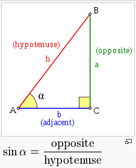

往返运行可以看作是一种振荡。振荡的一种直观现象，就象一个乒乓球飞入一个夹缝内，然后在两个面间快速振荡一样。在以往机械摆钟流行的时候，钟摆是一个常见的振荡现象；从物理学上来说，可以使用简谐振荡(simple harmonic oscillator)来模拟这种运行。
简谐振荡的公式是：
x(t) = amplitude * sin(t * 2PI / period) + x0

这里用到了sin函数；
sin是简写，全写是sine [saɪn] n. 正弦函数，三角函数之一
正弦函数用途很广，我们日常用的交流电的波形，就是正弦波。
它的定义如图：

一个角，如上图中的 (读作alpha)的sin值，就是它的对边长度除以斜边长度。即a/h。

参考：https://en.wikipedia.org/wiki/Sine
