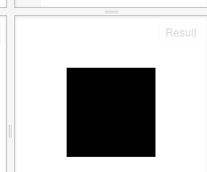
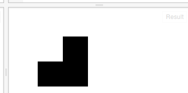
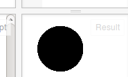
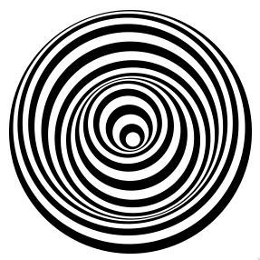

动画的原理，就是利用人的视觉暂留效应。以一定的频率（指定时间内重复的次数）来绘制不同的图，就可能产生动画效果。这里有一点要注意，画新的画时，要擦掉旧的画。我们来看看画是怎么擦的。


我们先来画一个矩形：

HTML:
```
<!-- 定义一块256*256像素大小的画布 -->
<canvas id="myCanvas" width="256" height="256"></canvas>
```

Javascript:
```
// 准备一块二维世界的画布
var canvas = document.getElementById("myCanvas");
var context = canvas.getContext("2d");

// 开始向画布上画
context.fillRect(50, 50, 100, 100);
```

这样便画出了一个矩形：


让我们在最后加上一句： 
```
context.clearRect(0, 0, canvas.width, canvas.height);
```
然后看效果：
http://jsfiddle.net/archcra/qaaox7yL/9/

这里就给出示例图了，因为什么也没有。什么也没有是因为擦得太多了：把整个画布都擦干净了，所以什么也没有了。

我们修改一下最后一行：
```
context.clearRect(50, 50, 50, 50);
```
可以通过这里看效果：http://jsfiddle.net/archcra/qaaox7yL/10/
我们会看到矩形被擦掉了1/4，如下图所示：




如果不断地重复擦与画的过程，就可能产生动画。


下面我们以简单的符号来演示一下：
Javascript:
```
// 准备一块二维世界的画布
var canvas = document.getElementById("myCanvas");
var context = canvas.getContext("2d");

// 开始向画布上画
context.font = '64pt Arial';
//◐ ◓ ◑ ◒
//◴ ◷ ◶ ◵
var charsArray = ['◐', '◓', '◑', '◒'];
var charIndex = 0;

function drawText(text) {
    context.fillText(text, 10, 64);
    setTimeout(drawText, 20, nextChar());
}

var getNextCharFun = function () {
    return function () {
        var result = charsArray[charIndex];
        charIndex = charIndex + 1;
        if (charIndex == 4) {
            charIndex = 0;
        }
        return result;
    }
};
var nextChar = getNextCharFun();
drawText('◐');
```
我们会看到如下结果：


上面的程序是每隔20毫秒绘下一个符号：在4个符号间反复循环画。结果是一个不动的图，当然，动的图这里也没办法展示。

之所以不动，是因为没有擦除。我们把擦除加上：
修改drawText函数如下：
```
function drawText(text) {
    context.clearRect(0, 0, canvas.width, canvas.height);
    context.fillText(text, 10, 64);
    setTimeout(drawText, 20, nextChar());
}
```
这回就应该能看到动图了，可以到这里看效果：

http://jsfiddle.net/archcra/u6837w16/5/


参考链接：
http://stackoverflow.com/questions/2685435/cooler-ascii-spinners

我们前面讲的动画，如匀速运动、往返运动等，都是直接修改画的物体的位置；还有一种动画方法，是移动画布。虽然原理一样，但是有时候用起来却很方便。

可以到这里来看动画效果：https://jsfiddle.net/archcra/s0dnh49x/

它的静态图是这样的：


这里不会动，看动画需要到上面的链接上去看。它就是由移动画布产生的结果。

当然，这个动画也可以使用CSS来实现。
http://jsfiddle.net/codepo8/g9898/5/light/


而CSS制作的动画，也可以由画布来实现；这就是为什么在第一章时，为什么我们给了一个CSS的示例，来说明画布能做的事情。
