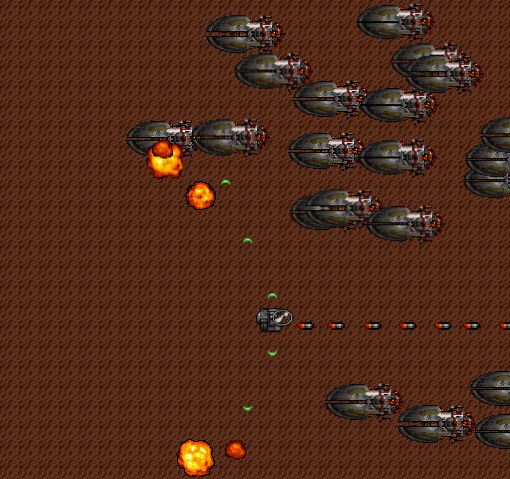
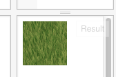
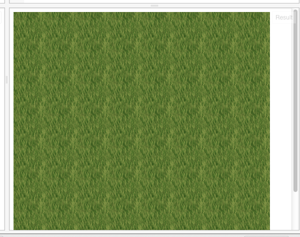
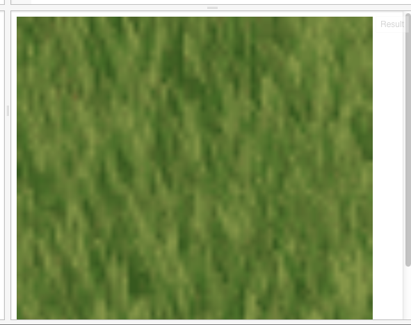

我们希望制作的游戏样子是这样：



即是水平（左右）滚动的；实际上，制作游戏和制作电影类似，是需要很多分工的；如制作电影时，需要有人制作剧本，有人负责道具，有人负责美工，有人负责音乐，有人负责服装，...
做游戏也类似，也是需要分工的；虽然我们也是像画布上画图，但我们还是要尽量利用现有资源。
网上专门有游戏相关素材：
http://hasgraphics.com/

这里就是利用了这里的素材：http://www.lostgarden.com/2005/03/game-post-mortem-hard-vacuum.html

它的背景是这样的一张图：


没错，就是这么大的图；

terrain [təˈren] n. 地带

这是游戏中常见的一种技术。如一块草坪，我们在屏幕上看着很大，实际上原始的素材是很小的一块小图；它是通过重复画这个小图，来得到一个大图的；这个魔法，是由context的createPattern函数，来得到的效果；

下面我们试试这个createPattern。
先使用这个底图直接画上：
http://jsfiddle.net/archcra/LLt4br6e/

HTML:
```
<!-- 定义一块512*512像素大小的画布 -->
<canvas id="myCanvas" width="512" height="512"></canvas>
```
Javascript:
```
// 准备一块二维世界的画布
var canvas = document.getElementById("myCanvas");
var context = canvas.getContext("2d");

// 开始向画布上画
var img = new Image;
img.src = 'https://dl.dropboxusercontent.com/u/67200561/Pictures/jsfiddle/grass01.png';
img.onload = function () {
    context.drawImage(img, 0, 0);
};
```
我们会看到如下的效果：



我们将image.onload改成这样：
```
img.onload = function () {
    var pattern = context.createPattern(img, 'repeat');
    context.fillStyle = pattern;
    context.fillRect(0, 0, 512, 512);
};
```
就会看到图变大了，但不是缩放变大(http://jsfiddle.net/archcra/LLt4br6e/3/)：



对比一下放大画法的效果(http://jsfiddle.net/archcra/LLt4br6e/5/)：
```
img.onload = function () {
    context.drawImage(img, 0, 0, 512, 512)
};
```


效果还是很不同的。

