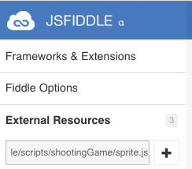
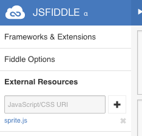
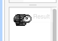
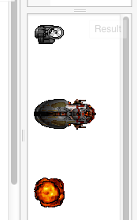

关于精灵的动画，和我们以前讲的方法一样，就是重复地画一些图，来达到动画的效果。这些图叫关键帧（keyframe animation），这种动画的方法就叫做关键帧动画：keyframe animation。

keyframe [ki:f'reɪm] n. 关键帧
animation [ˌænəˈmeʃən] n. 动画片

不过，这里使用具体技术，和前面的画多个图，虽然原理一样，但方法有些不同-它是将所有帧（一帧就是一幅图）放到一张图片中。这样做，是有些奇怪的，不过这做做也有它的好处。这样的图，叫精灵图：sprite map。
我们使用的图，是这样的：


就是说，它把敌人的战舰、炸弹等，都放到了一张图中。那，怎么使用呢？
我们虽然把主角叫sprite，实际上所有游戏中可动的东西，都可以叫sprite。我们专用使用一段代码，来管理sprite:
这段代码目前不需要我们修改，所以，我们使用它即可。使用的方法，是应用jsfiddle的External Resources。
我们来学习两个单词：
external [ɪkˈstɜ:rnl] a. 外部的
resource [ˈri:sɔ:rs] n. 资源


它位于界面的左上面，如下所示：

我们加入这样的URL: https://dl.dropboxusercontent.com/u/67200561/jsfiddle/scripts/shootingGame/sprite.js
然后点那个加号，就会加上这个外部资源了。加完后，界面是这样的：


下面出现了sprite.js信息。下一步，我们来看如何使用它。

Javascript中，输入这样的代码：
```
// 准备一块二维世界的画布
var canvas = document.getElementById("myCanvas");
var context = canvas.getContext("2d");

// 准备sprite
var player = new Sprite('https://dl.dropboxusercontent.com/u/67200561/jsfiddle/images/sprites.png', [0, 0], [39, 39], 16, [0, 1]);
    player.pos = [0, 0];

// 准备图片资源
resources.load([
    'https://dl.dropboxusercontent.com/u/67200561/jsfiddle/images/sprites.png']);
resources.onReady(start);

// 开始
function start() {
   player.render(context);
}
```
运行后，我们就会看到飞机出现了。当然，目前它还不会动。不过已完全了一些重要的功能，即从一张大图中，只显示了我们需要的部份。


相应的代码在这里可以找到：http://jsfiddle.net/archcra/gvvf9q6t/

下面我们让它动：
```
// 准备一块二维世界的画布
var canvas = document.getElementById("myCanvas");
var context = canvas.getContext("2d");

// 准备sprite
var player = new Sprite('https://dl.dropboxusercontent.com/u/67200561/jsfiddle/images/sprites.png', [0, 0], [39, 39], 1, [0, 1]);
player.pos = [0, 0];

// 准备图片资源
resources.load([
    'https://dl.dropboxusercontent.com/u/67200561/jsfiddle/images/sprites.png']);
resources.onReady(start);

// 开始
function start() {
    render();
}

function render() {
    player.update(1);
    player.render(context);
    setTimeout(render, 10);
}
```
这样它就可以动了，相应的代码在这里：http://jsfiddle.net/archcra/gvvf9q6t/6/

我们可以继续加入其它的精灵：

```
// 准备一块二维世界的画布
var canvas = document.getElementById("myCanvas");
var context = canvas.getContext("2d");

var spriteUrl = 'https://dl.dropboxusercontent.com/u/67200561/jsfiddle/images/sprites.png';
// 准备sprite
var player = {
    pos: [0, 0],
    sprite: new Sprite(spriteUrl, [0, 0], [39, 39], 1, [0, 1])
};

var ship = {
    pos: [0, 100],
    sprite: new Sprite(spriteUrl, [0, 78], [80, 39], 1, [0, 1, 2, 3, 2, 1])
};

// 准备图片资源
resources.load([
spriteUrl]);
resources.onReady(start);

// 开始
function start() {
    render();
}

function renderEntity(entity) {
    context.save();
    context.translate(entity.pos[0], entity.pos[1]);
    entity.sprite.render(context);
    context.restore();
}

function render() {
    // Animate the player
    player.sprite.update(1);
    renderEntity(player);
    
    // Animate the ship
    ship.sprite.update(1);
    renderEntity(ship);
	
    // 重复
    setTimeout(render, 100);
}
```
这样可以看到两个会动的东西：http://jsfiddle.net/archcra/gvvf9q6t/7/

这里会有三个会动的：http://jsfiddle.net/archcra/gvvf9q6t/8/

下面是样子示例，不过是不会动的：


关于精灵我们就介绍到这里。


