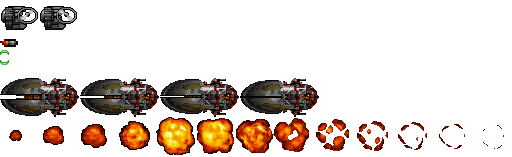

关于精灵的动画，和我们以前讲的方法一样，就是重复地画一些图，来达到动画的效果。这些图叫关键帧（keyframe animation），这种动画的方法就叫做关键帧动画：keyframe animation。

keyframe [ki:f'reɪm] n. 关键帧
animation [ˌænəˈmeʃən] n. 动画片

不过，这里使用具体技术，和前面的画多个图，虽然原理一样，但方法有些不同-它是将所有帧（一帧就是一幅图）放到一张图片中。这样做，是有些奇怪的，不过这做做也有它的好处。这样的图，叫精灵图：sprite map。
我们使用的图，是这样的：

就是说，它把敌人的战舰、炸弹等，都放到了一张图中。那，怎么使用呢？

