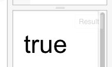
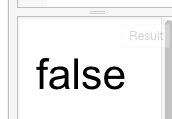

关于整个的碰撞检查，我们先不考虑；这里只介绍一下处理的逻辑。
程序代码做了一个循环，对每一艘敌舰做处理-检查它是否与其它精灵相撞。它会使用另一个循环，来为每一艘敌舰和所有的子弹做碰撞检查，如果有碰撞，则在相应的位置填加一个爆炸精灵（对，爆炸也是精灵，只不过是会自动消失的精灵），然后将相应的子弹和战舰删除。

如果战舰和玩家精灵有碰撞，则游戏结束。

以上就是关于碰撞的处理逻辑。


实现碰撞检查的代码如下：
```
// Collisions
function collides(x, y, r, b, x2, y2, r2, b2) {
    return !(r <= x2 || x > r2 || b <= y2 || y > b2);
}

function boxCollides(pos, size, pos2, size2) {
    return collides(pos[0], pos[1],
    pos[0] + size[0], pos[1] + size[1],
    pos2[0], pos2[1],
    pos2[0] + size2[0], pos2[1] + size2[1]);
}
```
学两个单词：
collide [kəˈlaɪd] vi.碰撞
collision [kəˈlɪʒən] n.碰撞
它主要是通过boxCollides函数来实现；它如果返回true，表示两个box有碰撞；如果返回false，则表示没有；即这个函数用来判断两个矩形是否有位置的重叠。它需要的参数是：
pos 第一个矩形物体的位置
size 第一个矩形物体的大小
pos2 第二个矩形物体的位置
size2 第二个矩形物体的大小

位置是两个值，即离左边的距离x，和离上边的距离y；单位是像素。
大小也是两值，分别是宽和高；单位也是像素；

然后它调用了另外一个函数：collides来检查具体是否有碰撞；
它判断的逻辑是：
满足下面条件之一，则没有碰撞：
第一个物体的 x1 + width1 < x2 ；即第一个物体的距左面距离加上它的宽，如果还比第二个物体距左边的距离小的话，则一定没有碰撞；
同样，y1 + height1 < y2的话，即第一个物体的距上边距离加上它的高度，如果还比第二个物体距离上边的距离小的话，则一定没有碰撞；
同样，这个规律适合于把两个物体换过来考虑；
即把上面的x1等使用x2替换，还是同样成立。
就是说：
x2 + width2 < x1 成立的话，则一定没有碰撞；即：
如第二个物体的距左面距离加上它的宽，如果还比第一个物体距左边的距离小的话，则一定没有碰撞；
四种没有碰撞的条件如果满足之一，则没有碰撞；如果都不满足，则一定有碰撞。


在这里，我们简单介绍Javascript最基本的东西：基本数据类型：primitive value。
primitive [ˈprɪmɪtɪv] a. 原始的
这个象是原力，虽然原始，但是非常重要。
基本数据类型有：Undefined, Null, Boolean, Number, Symbol, String 
undefined  [ˌʌndɪˈfaɪnd] a. 未定义的
null [nʌl] n. 空
boolean [ˈbuliən] n. 布尔型；逻辑值
number  [ˈnʌmbɚ] n.数字
symbol [ˈsɪmbəl] n.符号
string  [strɪŋ] n. 绳子，串，字符串

我们看到的数字，都是Number类型；看到的这样的值：'red'，就是String-字符串型的值；
这里我们要介绍的，是Boolean-布尔值，或称逻辑值；
Boolean类型的数值只有两个值：true和false。
使用大于号(>)、小于号(<)这样的计算，可以得到Boolean值：
HTML还是这样：
```
<!-- 定义一块512*512像素大小的画布 -->
<canvas id="myCanvas" width="512" height="512"></canvas>
```
Javascript这样：
```
// 准备一块二维世界的画布
var canvas = document.getElementById("myCanvas");
var context = canvas.getContext("2d");

// 开始向画布上画
context.font = '32pt Arial';
context.fillText(2 > 1, 10, 64);
```
这里，我们要做的，是将fillText函数的第一个参数，画到画布上；它是2>1的值，结果如下：

相应的代码位于这里：http://jsfiddle.net/archcra/Lj3mLcto/

我们换一个，改成；
```
context.fillText(1 > 2, 10, 64);
```
结果是我们期望的样子：


布尔值主要有三种运算：与、或非，即and, or, not。在Javascript中，它们的符号是这样的：
and  &&
or ||
not !
上面的fillText修改其中的参数，容易改错。我们定义一个变量，这样在试验时，只改这个变量的值，就会减少出错的机会；代码变成这样：
```
// 准备一块二维世界的画布
var canvas = document.getElementById("myCanvas");
var context = canvas.getContext("2d");

// 开始向画布上画
var testValue = 1 > 2;

context.font = '32pt Arial';
context.fillText(testValue, 10, 64);
```
它的结果是false，并没有变化。不过我们再修改测试boolean运算时，只修改
```
var testValue = ...
```
这行就可以了。

我们改成这样试试：

```
var testValue = true && true ;

```
这个结果是true；
```
var testValue = true && false ;
```
这个结果是false；
```
var testValue = true || false ;
```
这个是true；

&& 和 || 运算符是符合交换率的，即 a && b 与 b && a的结果是一样的；
修改成：
```
var testValue = !true;
```
这个就是取反的意思，结果是false。


知道了这些，我们看碰撞代码中的|| 和! 就不会感觉特别困惑了。


参考：http://www.ecma-international.org/ecma-262/6.0/index.html#sec-primitive-value


